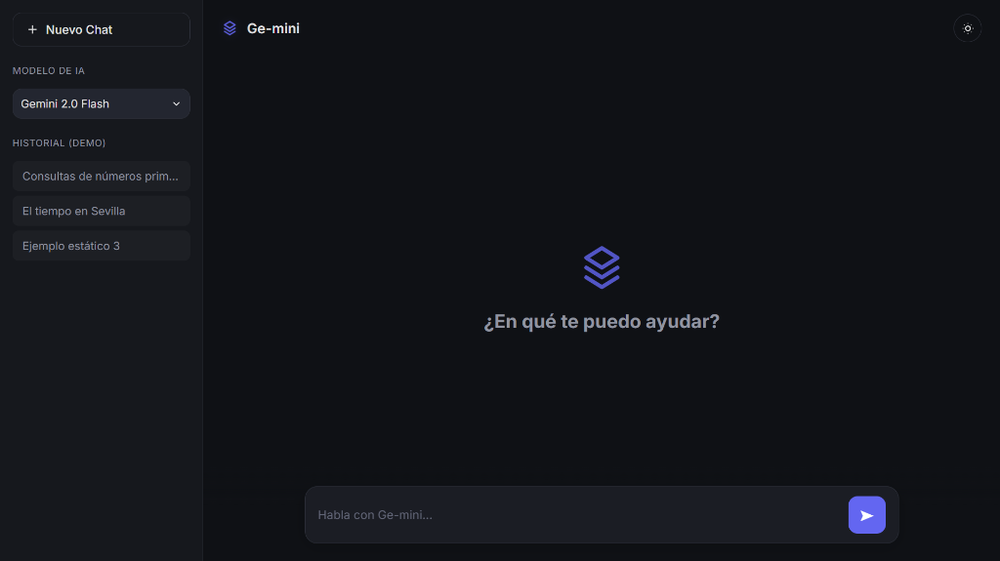

# Ge-mini 💠

Ge-mini es una interfaz de chat inteligente, minimalista y de alto rendimiento que permite interactuar con múltiples modelos de IA (Google Gemini y Groq/Llama) desde una única plataforma unificada.



## ✨ Características Principales

- **🤖 Multimodelo:** Selector dinámico para cambiar entre Gemini 2.0/2.5 y Llama 3.3/3.1 en tiempo real.
- **🧠 Memoria Unificada:** Cambia de modelo a mitad de una conversación sin perder el contexto. La memoria se mantiene compartida entre todos los proveedores.
- **🌓 Dual Theme:** Soporte completo para Modo Oscuro (Premium) y Modo Claro con persistencia en el navegador.
- **🎨 Estética Refinada:** Interfaz inspirada en las mejores prácticas de UI/UX modernas, con transiciones suaves y Markdown de alta fidelidad.
- **⚡ Respuesta Instantánea:** Optimización de latencia y gestión inteligente de indicadores de escritura.
- **🛠 Gestión de Cuotas:** Detección automática de errores de límite de tokens con mensajes amigables para el usuario.

## 🚀 Instalación Rápida

1. **Clonar el repositorio:**
   ```bash
   git clone https://github.com/DaniRZ10/Ge-mini.git
   cd Ge-mini
   ```

2. **Crear entorno virtual e instalar dependencias:**
   ```bash
   python -m venv .venv
   source .venv/bin/activate  # En Windows: .venv\Scripts\activate
   pip install -r requirements.txt
   ```

3. **Configurar variables de entorno (`.env`):**
   Crea un archivo `.env` en la raíz con tus claves de API:
   ```env
   GEMINI_API_KEY=tu_clave_aqui
   GROQ_API_KEY=tu_clave_aqui
   ```

4. **Lanzar el servidor:**
   ```bash
   uvicorn app.main:app --reload
   ```
   *También puedes usar el script automatizado en Windows: `tools\start_app.bat`*

5. **Acceder:**
   Abre [http://127.0.0.1:8000/static/index.html](http://127.0.0.1:8000/static/index.html) en tu navegador.

## 📂 Estructura del Proyecto

```text
Ge-mini/
├── app/               # Lógica del Backend (Python)
├── static/            # Frontend (HTML, CSS, JS)
├── data/              # Base de datos SQLite
├── docs/              # Capturas y documentación
├── tools/             # Scripts de ejecución (.bat)
├── requirements.txt   # Dependencias del proyecto
└── .env               # Configuración secreta
```

## 🛠 Tecnologías Utilizadas

- **Backend:** FastAPI (Python 3.10+)
- **Frontend:** HTML5, CSS3 Variables, JavaScript Vanilla.
- **IA:** Google GenAI SDK, Groq SDK.
- **Markdown:** Marked.js para el renderizado de respuestas.

---
*Desarrollado con ❤️ para el proyecto Ge-mini.*
