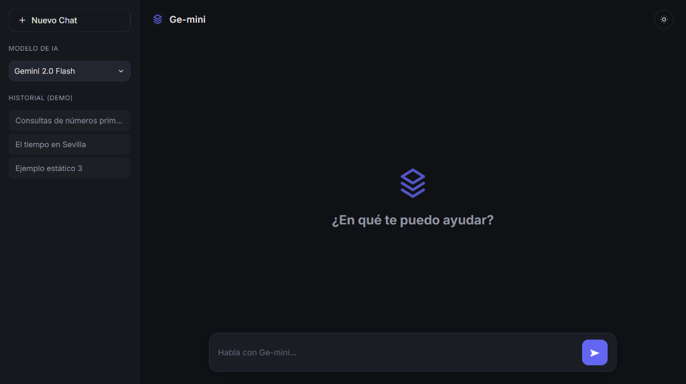

# Ge-mini 💠

Ge-mini es una interfaz de chat inteligente, minimalista y de alto rendimiento que permite interactuar con múltiples modelos de IA (Google Gemini, Groq/Llama y **IA Local con Ollama**) desde una única plataforma unificada.



## ✨ Características Principales

- **🤖 Multimodelo:** Selector dinámico para cambiar entre Gemini, Llama (Groq) e **IA Local (Ollama)** en tiempo real.
- **⚡ Real-Time Streaming:** Respuestas instantáneas palabra a palabra gracias a la implementación de `StreamingResponse` y `ReadableStream`.
- **🧠 Memoria Unificada:** Cambia de modelo a mitad de una conversación sin perder el contexto. Soporte total para el historial incluso en modelos locales.
- **🌓 Dual Theme:** Soporte completo para Modo Oscuro (Premium) y Modo Claro con persistencia en el navegador.
- **🎨 Estética Refinada:** Interfaz premium con transiciones suaves, **glassmorphism** y "Smart Scroll".
- **🛠 Gestión de Cuotas:** Detección automática de errores de límite de tokens con mensajes amigables.
- **🛡️ Seguridad:** Sanitización XSS integrada con `DOMPurify` para un renderizado seguro de Markdown.
- **📜 Migraciones:** Gestión de base de datos profesional con **Alembic**.

## 🚀 Instalación

| Plataforma | Comando |
|---|---|
| Windows | Doble clic en **`install.bat`** |
| Linux | `sh install.sh` en la raíz del proyecto |

El instalador se encarga de todo: Python, entorno virtual, Ollama, descarga de modelos y claves API. No se requiere ningún software previo.

Para arranques posteriores: **`start.bat`** (Windows) o **`sh start.sh`** (Linux).

> **macOS / instalación manual:** consulta [`docs/manual/instalacion.md`](docs/manual/instalacion.md).

## 🧪 Pruebas (Testing)

Para ejecutar los tests automatizados y asegurar que todo funciona:
- **Windows:** Ejecuta `tools\run_tests.bat`.
- **Manual (Terminal):** `.venv\Scripts\python.exe -m pytest`.


## 📂 Estructura del Proyecto (Clean Architecture)

```text
Ge-mini/
├── app/
│   ├── domain/         # Entidades puras e interfaces (Repository/Provider)
│   ├── application/    # Lógica de orquestación (Servicios de Chat)
│   ├── infrastructure/ # Implementaciones (SQLAlchemy, AI Adapters)
│   ├── core/           # Configuración global (Logging)
│   └── main.py         # Punto de entrada FastAPI
├── migrations/         # Versiones de base de datos (Alembic)
├── static/             # Frontend (HTML, CSS con Glassmorphism, JS)
├── data/               # Base de datos SQLite
├── tests/              # Suite de pruebas SDD (pytest)
└── .specify/           # Especificaciones del diseño (SDD)
```

## 🛠 Tecnologías Utilizadas

- **Backend:** FastAPI con Clean Architecture.
- **ORM/Persistencia:** SQLAlchemy 2.0 (Async) + Alembic para migraciones.
- **Frontend:** JavaScript Vanilla + DOMPurify (Seguridad) + Marked.js.
- **Logging:** Módulo `logging` configurado para depuración estructurada.
- **IA Cloud:** SDK `google-genai` (Google Gen AI SDK) + Groq SDK.

---
*Desarrollado con ❤️ para el proyecto Ge-mini.*
